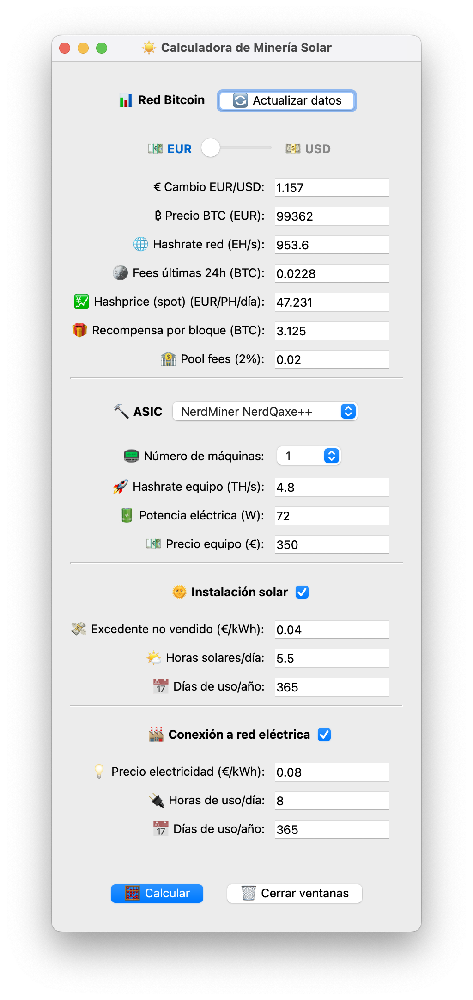
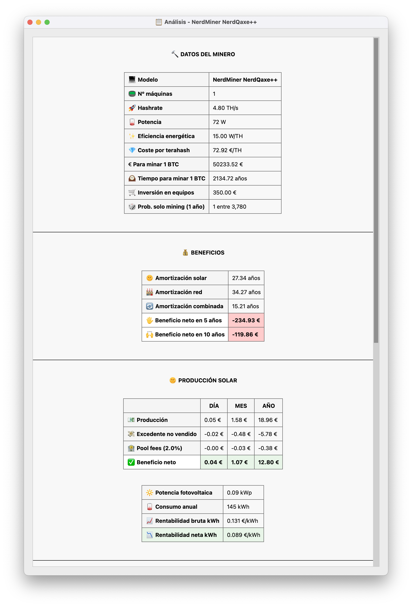
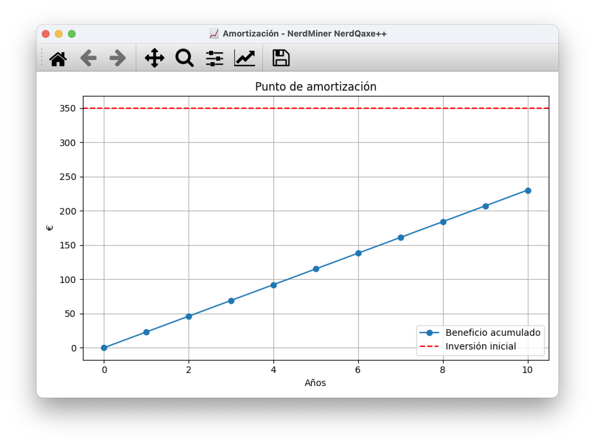

# ☀️ Calculadora de Minería Solar 

App en Python para calcular la rentabilidad de minar Bitcoin utilizando energía solar, red eléctrica o una combinación de ambas. Incluye datos en tiempo real de la red Bitcoin y análisis de rentabilidad detallado.

### 📋 **Requisitos Previos**
- [Python 3.12 o superior](https://www.python.org/downloads/) 
- pip (gestor de paquetes de Python, incluido con Python)

### 🐧 **Linux/macOS - Instalación Rápida**

```bash
# 1. Clonar o descargar el proyecto
cd /ruta/a/tu/proyecto

# 2. Instalar dependencias
pip install -r requirements.txt

# 3. Ejecutar la aplicación
python Calculadora_mineria_solar.py
```

### 🪟 **Windows - Instalación Rápida**

```cmd
# 1. Abrir Command Prompt o PowerShell como administrador
# 2. Navegar al directorio del proyecto
cd C:\ruta\a\tu\proyecto

# 3. Instalar dependencias (puede requerir compilación)
pip install PySide6 matplotlib requests numpy

# 4. Si hay errores con PySide6, usar wheel precompilado:
pip install --only-binary=all PySide6

# 5. Ejecutar la aplicación
python Calculadora_mineria_solar.py
```


---

## ✨ Características

### 🔄 **Tiempo Real**
- Precio de Bitcoin (EUR/USD) desde APIs
- Hashrate global de la red Bitcoin
- Fees promedio por bloque
- Tipo de cambio EUR/USD actualizado

### ⚙️ **Configuración**
- Soporte para múltiples ASICs predefinidos
- Configuración solar: horas de sol, días de uso
- Configuración red eléctrica: precio kWh, horas de uso
- Número escalable de máquinas (1-1000)

### 📊 **Análisis**
- Cálculo de rentabilidad por kWh
- Tiempo de amortización
- Gráficas de amortización interactivas
- Comparativa solar vs red eléctrica
- Probabilidad de minado en solitario

### 💰 **Multi-Divisa**
- Visualización en EUR o USD
- Cálculos internos siempre en EUR (precisión máxima)
- Conversión automática en tiempo real

---

## 🚀 Instalación y Configuración

### 📋 **Requisitos Previos**
- [Python 3.12 o superior](https://www.python.org/downloads/) 
- pip (gestor de paquetes de Python, incluido con Python)

### ⚡ **Instalación**

```bash
# 1. Clonar o descargar el proyecto
cd /ruta/a/tu/proyecto

# 2. Instalar dependencias
pip install -r requirements.txt

# 3. Ejecutar la aplicación
python Calculadora_mineria_solar.py
```

---

## 🎮 Uso de la Aplicación

### **Pasos Básicos**
1. **🔄 Actualizar datos** - Obtener información en tiempo real de Bitcoin
2. **💱 Seleccionar moneda** - EUR/USD con el slider
3. **⚙️ Elegir ASIC** - Modelo predefinido o personalizado
4. **💡 Configurar energía** - Solar, red eléctrica o híbrido
5. **📊 Analizar resultados** - Gráficas y métricas financieras

---

## 📁 Estructura del Proyecto

```
Mineria/
├── Calculadora_mineria_solar.py     # Aplicación 
├── README.md                        # Este archivo
├── requirements.txt                 # Dependencias Python
└── LICENSE                          # Licencia del proyecto
```

---


## 📊 Ejemplo de Uso

```python
# La aplicación incluye ASICs predefinidos como:
MINEROS = {
    "Antminer S19 Pro": {"ths": 110, "consumo": 3250, "precio": 1200},
    "Antminer S21": {"ths": 200, "consumo": 3550, "precio": 2500},
    "Fluminer T3": {"ths": 115, "consumo": 1700, "precio": 1900},
    "Avalon Q": {"ths": 90, "consumo": 1674, "precio": 1500},
    "Avalon Nano 3S": {"ths": 6, "consumo": 140, "precio": 290},
    "NerdMiner NerdQaxe++": {"ths": 4.8, "consumo": 72, "precio": 350},
    "NerdMiner NerdQaxe+ Hyd": {"ths": 2.5, "consumo": 60, "precio": 429},
    "Bitaxe Touch": {"ths": 1.6, "consumo": 22, "precio": 275},
    "Bitaxe Gamma 601": {"ths": 1.2, "consumo": 17, "precio": 58},
    "Bitaxe Gamma Turbo": {"ths": 2.5, "consumo": 36, "precio": 347},
    "Bitaxe Supra Hex 701": {"ths": 4.2, "consumo": 90, "precio": 235},
}
```

**Escenario típico**:

💻 **Modelo**: Bitaxe Touch  
📟 **Máquinas**: 1  
🚀 **Hashrate**: 1.6 TH/s  
🪫 **Potencia**: 22 W  
✨ **Eficiencia energética**: 13.75 W/TH  
💎 **Coste por terahash**: 171.88 €/TH  
💶 **EUR para minar 1 BTC**: 43,133.03 €  
🕰️ **Tiempo para minar 1 BTC**: 5,961.24 años  
🛒 **Inversión en equipos**: 275.00 €  
🎲 **Prob. solo mining (1 año)**: 1 entre 10,613

---

## 📸 Capturas de Pantalla


*Interfaz principal de la calculadora con todos los controles*


*Análisis detallado de rentabilidad y métricas*


*Gráfica interactiva mostrando el punto de amortización*

---

## ⚠️ Disclaimer

Esta herramienta es solo para propósitos educativos y de planificación. Los resultados son estimaciones basadas en datos actuales que pueden cambiar. Factores como:

📉 Volatilidad del precio de Bitcoin
🔧 Dificultad de minado cambiante
📈 Variación en costos energéticos
🌤️ Condiciones climáticas para solar

Pueden afectar significativamente la rentabilidad real.

---

## 📞 Contacto

- **Autor**: @unlock_blocks
- **Issues**: Reporta problemas en GitHub
- **Mejoras**: Sugerencias bienvenidas

---

## 📄 Licencia

Este proyecto está bajo la Licencia MIT - ver el archivo [LICENSE](LICENSE) para detalles.